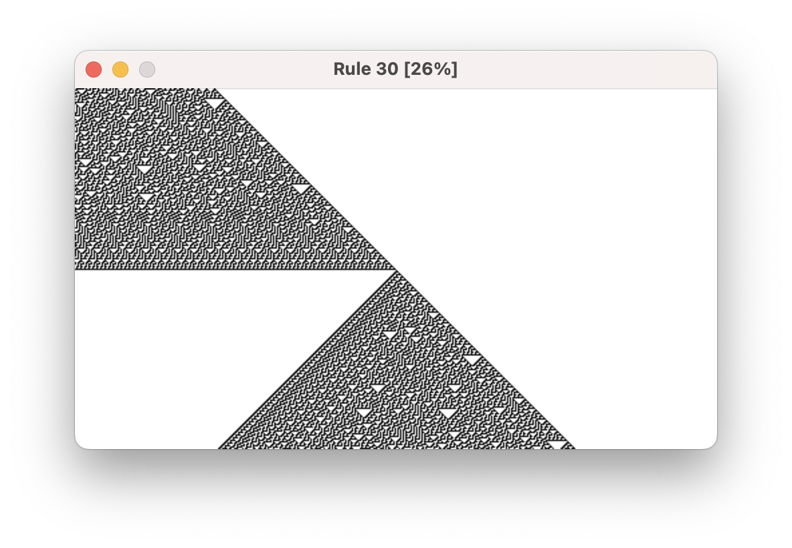

Rule 30
=======

*Render [Rule 30](https://en.wikipedia.org/wiki/Rule_30) forward and reversed.*

[Youtube](https://www.youtube.com/watch?v=xIGPsfhxSeI)

## Usage

    pip install -r requirements.txt
    python -m forward
    python -m reverse
    ffmpeg -framerate 60 -i recording/forward/%d.png -vcodec libx264 forward.mp4

## License

MIT
